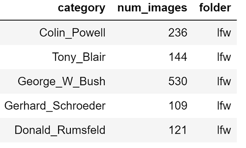

# Machine Learning Engineer Nanodegree
## Capstone Project
Jong Lee  
July 22, 2020

## I. Definition

### Project Overview
Image identification and classification has been one of the most prominent and rising Machine Learning research areas. Examples include self-driving cars recognizing cross streets and people[1](#f1), as well as medical radiology to analyze MRI and CT scans[2](#f2). Among many cases, animal recognition has bee one of the foundational use cases which set the groundwork for other image recognition use cases. While there are a range of Machine Learning algorithms that can solve this image recognition problem, neural networks have been one of the most prominent algorithms with the rise in computing power and GPUs[3](#f3). Neural networks perform well not only in binary classification but also in multi-classification problems, especially with large amounts of data and features, which is typical of many image recognition problems. In our project, we aim to illustrate the power of CNNs in classifying different dog breeds [(dataset)](https://s3-us-west-1.amazonaws.com/udacity-aind/dog-project/dogImages.zip) and identifying breeds most resembling a given human image [(dataset)](https://s3-us-west-1.amazonaws.com/udacity-aind/dog-project/lfw.zip). Additionally, beyond training a CNN from scratch we wish to test the effect of transfer learning in training other image recognition models as well.

### Problem Statement
Largely, there are two problems we are aiming to solve:
- **Dog breed classifier**: Given an image of a dog, identify the closest canine breed to that dog image.
- **Human resembler/classifier**: Given an image of a human, identify the most closely resembling canine breed.

To solve these two problems, we will use **Convolutional Neural Networks (CNN)**. A CNN is a deep neural network model which uses a combination of features, weights, and bias to output - in our case - a dog breed classification. Specifically in our project, our overall solution will involve multiple models, each developed in the steps below:
1. Create a dog/human detector (whether an image is of a dog/human) using pre-trained models
2. Create a dog breed classifier from scratch
3. Use transfer learning to develop a new model (not from scratch)

Using either the model from 2) or 3) (whichever performs better), we can test how accurate the models are in solving our two problems of dog breed classification & identification.

### Metrics
One may initially choose accuracy as an evaluative metric of our models: that is, what % of the dog images did we corectly predict/classify the true dog breed? However, one downside to note is that accuracy doesn't fully reflect the imbalance in our datasets, with more than 100 different dog breeds; accuracy will have our models become biased towards the most common classes. Therefore while accuracy is a helpful measure to look at heuristically, we will be using the widely recognized multi-class log loss function to train the model, which will account for class imbalances. The loss can be described as:

Where `x` is the list of predicted probabilities, and `class` is the numeric index of the true class.

## II. Analysis

### Data Exploration and Exploratory Visualization

The data we will use to train the models are images, as we are developing image recognition models. There are two types of images we are using: 1) dog images, and 2) human images. The images dataset was provided by Udacity.
- **Dog images**: There are a total of 8351 dog images. 6680 (80%) are training, 836 (10%) are in validation, and 835 (10%) are in testing sets. Furthermore, there are 133 folders each corresponding to a different dog breed. The images are taken from a variety of angles, backgrounds, and sizes. One important aspect to note is that some dog breeds have more images than others, resulting in a non-uniformly balanced dataset, as seen from the histogram below.

 

- **Human images**: There are a total of 13233 human images, with 5750 different folders corresponding to different holders. Similar to the dog images dataset, the human images have different backgrounds and angles; however, they are all sized the same (250 X 250). Furthermore, again like the dog images dataset, the human images dataset is not uniformly balanced, as some humans have more training images than others. This is imbalance in human image distributions is particularly worse, as seen from the histogram below:

There seems to be some folks who have > 100 number of images to them, which are outliers. The following humans are listed below:

It makes sense that people like George Bush or Colin Powell have large number of images attributed to them, as they are one of the most famous people in the world. That being said, while this imbalance is worse in the humans dataset than in the dogs dataset, it is less of an issue for our project, as the human images are **not** used as any sort of training inputs to any of the models; they are merely used at the end as inputs to test which dogs resemble these humans the most. Therefore, we can move on with the algorithm of the CNN training model.

 

### Algorithms and Techniques

There are two main type of models that we will be using in this project:
1. Detector algorithms: These models will detect whether a given image is an image of a dog, or a human. We will largely be using pre-trained models as they are effective and fast in training.
	- Dog detector: We will be using a [pre-trained VGG16 model](http://pytorch.org/docs/master/torchvision/models.html) to detect whether an image is an image of a dog.
	- Human detector: We wil be using a pre-trained [OpenCV Haar feature-based cascade classifiers](http://docs.opencv.org/trunk/d7/d8b/tutorial_py_face_detection.html)
2. Breed classification algorithms: These models will detect - given an image of a dog or human - which canine breed the image resembles the most:
	- Ground-up model from scratch: We will build a Convolutional Neural Network from scratch using the images from our datasets to train this model. We will build this model from scratch to illustrate how a CNN works, but also how this ground-up model compares from a transfer-learned model.
	- Transfer learned model: We will build another CNN which will be built on top of a pre-trained model from ResNet50 using transfer learning. This will illustrate how effective transfer learning is on image recogniition problems.

All of these models will be built on top of the PyTorch architecture/platform. 

### Benchmark
Our benchmark generally would be a random guess. For our specific example, we have 133 dog breeds; a simple random guess would achieve 1/133, or 0.75% accuracy. However, since we are using a CNN (which should be better than a random guess), our test set accuracy should achieve at least 10% accuracy.  
In the case of our transfer-learned model (not built from scratch), we would probably hope to achieve a better accuracy as we already have significant learnings from a previous model. Therefore, as a benchmark we would expect a test set accuracy of 60% or higher on our transfer-learned model.

## III. Methodology
_(approx. 3-5 pages)_

### Data Preprocessing
For the detector algorithms, a couple of preprocessing steps were required, namely:
- Grayscaling the image
- Resizing the image to 224 X 224
- Normalizing the image by a specific mean and standard deviation (as required by VGG-16)

As for our own CNN neural network models, different data preprocessing steps were applied for different sets:
- For training set:
	- Randomly resize and crop each image to 224 size
	- Randomly flip image horizontally with a probability of 30%
	- Convert image to a tensor
	- Normalize the image
- For testing and validation set:
	- Resize image to 224 X 224
	- Convert image to a tensor
	- Normalize the image

Random transformations were specifically applied to the training set in order to avoid overfitting. These transformations to the image may help the model become more robust to random angles/rotations of human and dog photos we could see in a normal day. As for the validation & testing set, I did not perturb the data further because we want our algorithm to focus on predicting the main, true image without random changes/transformations.

In terms of the image size, I decided to choose 224 X 224 because that seemed to be the norm (besides 256 X 256) and the image size which performed well in predictions. Furthermore, the normalization seemed to help with the predictions and minimizing outlier images' effects on the model.

Finally, while we did see some imbalance in the dogs dataset, I did not feel it was extremely skewed/imbalanced to the point the cross entropy multi class log loss would be able to handle it. Therefore, I did not make specific data preprocessing steps specific to class imbalance.

### Implementation

#### Structure of the layers
The dog and human detector models were largely based on pre-trained models (VGG16 and Haar classifier), and hence required minimal implementation besides data preprocessing.

For the ground-up CNN, there were multiple layers and types of layers that were interconnected. First, for the CNN layers, it was structured as the following:
- 1st CNN layer: 3 input channels, 32 output channels, 3x3 kernel size, stride=1, padding=1
- 2nd CNN layer: 32 input channels, 64 output channels, 3x3 kernel size, stride=1, padding=1
- 3rd CNN layer: 64 input channels, 128 output channels, 6x6 kernel size, stride=2, padding=2

Each CNN layer underwent a ReLU activation function and maxpooling with 2x2 kernel size and stride=2, effectively reducing the dimensions of the output from the layers by half. Specifically for 3rd CNN, it also went through a batch normalization in order to increase speed and efficiency in training. Furthermore, a larger kernel size and stride was chosen for the 3rd CNN layer in order to reduce overfitting and combine a more average effect in feature identification.

Next, the output from the 3rd CNN layer was flattened to be fed into the fully connected layers.

The fully connected layers consisted of three layers:
- 1st fully connected layer: 25088 input features, 256 output features
- dropout layer (with probability of 0.25)
- 2nd fully connected layer: 256 input features, 133 output features.

The 1st fully connected layer had ReLU activation function and batch normalization in order for increased efficiency in training. The dropout layer was used in order to minimize overfitting. Lastly, the 2nd fully connected layer outputed 133 features which corresponded to the 133 different dog breeds. No ReLU or Softmax activation function was required in the 2nd layer, as the `CrossEntropyLoss` loss function already takes care of it.

#### Loss function and optimizer
Once the structure of the layers were defined, we had to choose an appropriate loss and optimizer function. The loss function chosen was `CrossEntropyLoss` which was PyTorch's version of Multi class log loss function. As explained above, this loss function was chosen because of the multi-class type of problem and the slight class imbalance that persisted in the dataset.

The optimizer chosen was the Adam optimizer also imported from PyTorch - this is a very popular and successful optimizer for multi-class image recognition problems, and hence was chosen.

Through this process, we calculated the train and validation loss. Whenever the validation loss was lower than the previous minimum validation loss, we saved our new updated model. While the training was set for 100 epochs, I stopped training at around 20 epochs as the validation loss I believed was sufficient to achieve significantly better metrics than our benchmark metrics.

### Technology/Backend
Building of the neural network largely was conducted through defining a custome PyTorch Net class which was a subclass of the `nn.Module`. 

### Refinement

While the ground-up CNN model has some success in accurately predicting dog breeds (see results below), I wanted to test whether transfer learning would help significantly improve the performance. The ground-up CNN model was a model built based on my instinctions and some best practices, and on top of it only around 6000 dog images; however, there must be models already out there that are well-tested and trained on millions of images.

One of those models was the ResNet50 model, which was a 50-layer neural network model trained on millions of images from ImageNet. To test whether I could use this pre-trained model to improve results, I used transfer learning to edit the last layre of the ResNet50 model to output our 133 different dog breed as features, and saw immense improvements, as illustrated in the results section below.

## IV. Results
_(approx. 2-3 pages)_

### Model Evaluation and Validation

For the human face detector model, it had a 98% true positive rate (i.e. predicted 98 out of 100 true human faces as human faces.), and a 83% true negative rate (i.e. predicted 83 out of 100 non-human (dog) faces as non-human). While the true negative rate is somewhat disappointing, I took into consideration the fact that these metrics were calculated on the first 100 images fed into the models, and given the robustness of the OpenCV implementation of this Haas classifier, it was sufficient enough.

As for the dog detector model, it had a 100% true positive rate, and a 97% true negative rate on the first 100 dog images fed into the model which was sufficient. This may potentially be due to the fact that human faces are potentially more varied than dog faces, but that may be a speculation that could be tested later in the future.

For the dog classification CNN models, the final model was chosen after a number of epochs based on an out-of-sample validation set. An out-of-sample validation set was purposefully set and was absolutely necessary in order to avoid overfitting by evaluating on a training set. The validation loss was updated whenever we chose a newer, better model based on the validation Cross Entropy Loss as number of epochs increased. The model seemed to be meeting and exceeding our expectations, as illustrated below:
- For the ground-up CNN model after 22 epochs, it had a validation loss of 3.269494, and when used on a test set, the test loss was 3.281111 and test accuracy was 23%. 
- For the transfer-learning model after 20 epochs, it had a validation loss of 0.56974369, and a test loss of 0.579424 and test accuracy of 82%.

### Justification

The final results from the dog classification CNN models well exceeded our benchmark of a random guess, which would have achied <1% accuracy. In contrast, the built-from-scratch CNN model achieved a 23% accuracy. Furthermore, this was only after 22 epochs, which suggests that potentially after more iterations/epochs the performance can be much better.

The transfer-learned model well outperformed even our ground-up CNN model, with a test accuracy of 82%. While one may suggest that this may potentially be due to the model overindexing on dog breeds with large number of images, the test loss was also significantly minimal, and there wasn't a huge imbalance in our dog dataset. Hence, I believe these results are reliable and that the transfer-learned model is performing very well. Additionally from an outside-in perspective, this transfer-learned Resnet50 model was built on top of millions of images and thousands of seasoned researchers' work, and intuitively should be performing very well.

Therefore, I believe that both models, but especially the transfer-learned model, achieves our goal of creating a high-performing dog prediction classifier using image data.

## V. Conclusion
_(approx. 1-2 pages)_

### Free-Form Visualization
Using our transfer-learned dog classification model, we created a mini-app which - given an image - would 1) identify whether the image represents a human or a dog, and 2) output which dog breed the images resembles the most. See outputs below:

 

### Reflection

Overall, this project aimed to create a performing classifier which identified most resembling dog breeds given an image. The project had multiple components:
- A detection model which identified whether an image was an image of a dog, or a human
- A classification model which identified the most closely resembling dog breed given an image of a dog or a human
- A mini-"app" connecting the two models

In particular, building the model from scratch was difficult because there are many different ways to set up a CNN layer. It was difficult choosing what input channels, output channels, strides, kernel size, padding, etc to choose to make sure the model performed; perhaps that's why transfer learning is so popular because instead of relying on one person to verify his/her selection of the layer construction, there already is a well-performing network structure. Another difficult aspect was checking the dimensions/size of the layers - in some cases PyTorch would automatically handle the dimensions in respect to the batch size, but once flattening and feeding into the fully connected layer process was happening I had to manually ensure dimensions were of the correct size. 

The most interesting aspect of the study was definitely how effective the transfer learning model was - I was surprised by just changing one final fully connected layer from a pre-trained resnet50 model achieved so much better results than the built from scratch model which I put many hours into.

However overall through this process, I believe that the final transfer-learned model solved our original problem effectively of identifying most resembling dog breeds.

### Improvement

There are definitely ways to improve upon this project and the performance of the models.

First, more, and uniformed training data would definitely help with the training of the model built from scratch - we only had around 6000 images to train on top of, and 133 dog breeds to classify. 133 dog breeds is quite a lot, and hence accuracy did suffer consequentially. 

Additionally, more image/data augmentation or random transformations would help with the overfitting from the training set. While that wasn't clearly apparent in our project, in order for us to ensure that this model will work on other dog images, such transformations would definitely help significantly.

In terms of creating the model, perhaps some sort of a CV operation to choose the best parameters would help in choosing the right layers/parameters, as those were manually hand-picked by me. While the models did perform way better than the benchmark numbers, I believe there is still room for improvement if we had done extensive hyperparameter tuning.

Lastly, perhaps testing other pre-trained models besides Resnet50 (i.e. VGG, ResNet101, etc) would help test out what model would be best to transfer learn from. 

-----------

<a name="f1">1</a>: D. Cheng, Y. Gong, S. Zhou, J. Wang, N. Zheng. "Person re-identification by multi- channel parts-based cnn with improved triplet loss function". Proc. of IEEE Conference on Computer Vision and Pattern Recognition (27-30 June 2016), 10.1109/CVPR.2016.149  
<a name="f2">2</a>: McBee, Morgan P., et al. "Deep learning in radiology." Academic radiology 25.11 (2018): 1472-1480.  
<a name="f3">3</a>: Chen, Hongming, et al. "The rise of deep learning in drug discovery." Drug discovery today 23.6 (2018): 1241-1250.  

**Before submitting, ask yourself. . .**

- Does the project report you’ve written follow a well-organized structure similar to that of the project template?
- Is each section (particularly **Analysis** and **Methodology**) written in a clear, concise and specific fashion? Are there any ambiguous terms or phrases that need clarification?
- Would the intended audience of your project be able to understand your analysis, methods, and results?
- Have you properly proof-read your project report to assure there are minimal grammatical and spelling mistakes?
- Are all the resources used for this project correctly cited and referenced?
- Is the code that implements your solution easily readable and properly commented?
- Does the code execute without error and produce results similar to those reported?
