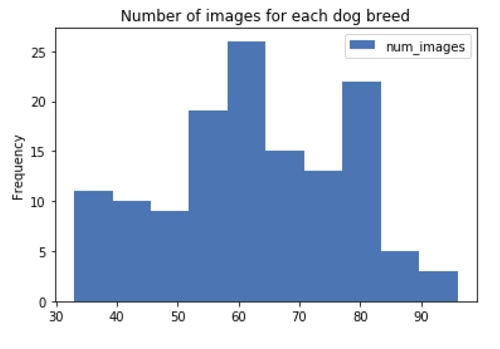

# Machine Learning Engineer Nanodegree
## Capstone Project
Jong Lee  
July 22, 2020

## I. Definition

### Project Overview
Image identification and classification has been one of the most prominent and rising Machine Learning research areas. Examples include self-driving cars recognizing cross streets and people[1](#f1), as well as medical radiology to analyze MRI and CT scans[2](#f2). Among many cases, animal recognition has bee one of the foundational use cases which set the groundwork for other image recognition use cases. While there are a range of Machine Learning algorithms that can solve this image recognition problem, neural networks have been one of the most prominent algorithms with the rise in computing power and GPUs[3](#f3). Neural networks perform well not only in binary classification but also in multi-classification problems, especially with large amounts of data and features, which is typical of many image recognition problems. In our project, we aim to illustrate the power of CNNs in classifying different dog breeds [(dataset)](https://s3-us-west-1.amazonaws.com/udacity-aind/dog-project/dogImages.zip) and identifying breeds most resembling a given human image [(dataset)](https://s3-us-west-1.amazonaws.com/udacity-aind/dog-project/lfw.zip). Additionally, beyond training a CNN from scratch we wish to test the effect of transfer learning in training other image recognition models as well.

### Problem Statement
Largely, there are two problems we are aiming to solve:
- **Dog breed classifier**: Given an image of a dog, identify the closest canine breed to that dog image.
- **Human resembler/classifier**: Given an image of a human, identify the most closely resembling canine breed.

To solve these two problems, we will use **Convolutional Neural Networks (CNN)**. A CNN is a deep neural network model which uses a combination of features, weights, and bias to output - in our case - a dog breed classification. Specifically in our project, our overall solution will involve multiple models, each developed in the steps below:
1. Create a dog/human detector (whether an image is of a dog/human) using pre-trained models
2. Create a dog breed classifier from scratch
3. Use transfer learning to develop a new model (not from scratch)

Using either the model from 2) or 3) (whichever performs better), we can test how accurate the models are in solving our two problems of dog breed classification & identification.

### Metrics
One may initially choose accuracy as an evaluative metric of our models: that is, what % of the dog images did we corectly predict/classify the true dog breed? However, one downside to note is that accuracy doesn't fully reflect the imbalance in our datasets, with more than 100 different dog breeds; accuracy will have our models become biased towards the most common classes. Therefore while accuracy is a helpful measure to look at heuristically, we will be using the widely recognized multi-class log loss function to train the model, which will account for class imbalances. The loss can be described as:

Where `x` is the list of predicted probabilities, and `class` is the numeric index of the true class.

## II. Analysis

### Data Exploration and Exploratory Visualization

The data we will use to train the models are images, as we are developing image recognition models. There are two types of images we are using: 1) dog images, and 2) human images. The images dataset was provided by Udacity.
- **Dog images**: There are a total of 8351 dog images. 6680 (80%) are training, 836 (10%) are in validation, and 835 (10%) are in testing sets. Furthermore, there are 133 folders each corresponding to a different dog breed. The images are taken from a variety of angles, backgrounds, and sizes. One important aspect to note is that some dog breeds have more images than others, resulting in a non-uniformly balanced dataset, as seen from the histogram below.

 

- **Human images**: There are a total of 13233 human images, with 5750 different folders corresponding to different holders. Similar to the dog images dataset, the human images have different backgrounds and angles; however, they are all sized the same (250 X 250). Furthermore, again like the dog images dataset, the human images dataset is not uniformly balanced, as some humans have more training images than others. This is imbalance in human image distributions is particularly worse, as seen from the histogram below:

There seems to be some folks who have > 100 number of images to them, which are outliers. The following humans are listed below:

It makes sense that people like George Bush or Colin Powell have large number of images attributed to them, as they are one of the most famous people in the world. That being said, while this imbalance is worse in the humans dataset than in the dogs dataset, it is less of an issue for our project, as the human images are **not** used as any sort of training inputs to any of the models; they are merely used at the end as inputs to test which dogs resemble these humans the most. Therefore, we can move on with the algorithm of the CNN training model.

 

### Algorithms and Techniques

There are two main type of models that we will be using in this project:
1. Detector algorithms: These models will detect whether a given image is an image of a dog, or a human. We will largely be using pre-trained models as they are effective and fast in training.
	- Dog detector: We will be using a [pre-trained VGG16 model](http://pytorch.org/docs/master/torchvision/models.html) to detect whether an image is an image of a dog.
	- Human detector: We wil be using a pre-trained [OpenCV Haar feature-based cascade classifiers](http://docs.opencv.org/trunk/d7/d8b/tutorial_py_face_detection.html)
2. Breed classification algorithms: These models will detect - given an image of a dog or human - which canine breed the image resembles the most:
	- Ground-up model from scratch: We will build a Convolutional Neural Network from scratch using the images from our datasets to train this model. We will build this model from scratch to illustrate how a CNN works, but also how this ground-up model compares from a transfer-learned model.
	- Transfer learned model: We will build another CNN which will be built on top of a pre-trained model from ResNet50 using transfer learning. This will illustrate how effective transfer learning is on image recogniition problems.

All of these models will be built on top of the PyTorch architecture/platform. 

### Benchmark
Our benchmark generally would be a random guess. For our specific example, we have 133 dog breeds; a simple random guess would achieve 1/133, or 0.75% accuracy. However, since we are using a CNN (which should be better than a random guess), our test set accuracy should achieve at least 10% accuracy.  
In the case of our transfer-learned model (not built from scratch), we would probably hope to achieve a better accuracy as we already have significant learnings from a previous model. Therefore, as a benchmark we would expect a test set accuracy of 60% or higher on our transfer-learned model.

## III. Methodology
_(approx. 3-5 pages)_

### Data Preprocessing
In this section, all of your preprocessing steps will need to be clearly documented, if any were necessary. From the previous section, any of the abnormalities or characteristics that you identified about the dataset will be addressed and corrected here. Questions to ask yourself when writing this section:
- _If the algorithms chosen require preprocessing steps like feature selection or feature transformations, have they been properly documented?_
- _Based on the **Data Exploration** section, if there were abnormalities or characteristics that needed to be addressed, have they been properly corrected?_
- _If no preprocessing is needed, has it been made clear why?_

### Implementation
In this section, the process for which metrics, algorithms, and techniques that you implemented for the given data will need to be clearly documented. It should be abundantly clear how the implementation was carried out, and discussion should be made regarding any complications that occurred during this process. Questions to ask yourself when writing this section:
- _Is it made clear how the algorithms and techniques were implemented with the given datasets or input data?_
- _Were there any complications with the original metrics or techniques that required changing prior to acquiring a solution?_
- _Was there any part of the coding process (e.g., writing complicated functions) that should be documented?_

### Refinement
In this section, you will need to discuss the process of improvement you made upon the algorithms and techniques you used in your implementation. For example, adjusting parameters for certain models to acquire improved solutions would fall under the refinement category. Your initial and final solutions should be reported, as well as any significant intermediate results as necessary. Questions to ask yourself when writing this section:
- _Has an initial solution been found and clearly reported?_
- _Is the process of improvement clearly documented, such as what techniques were used?_
- _Are intermediate and final solutions clearly reported as the process is improved?_

## IV. Results
_(approx. 2-3 pages)_

### Model Evaluation and Validation
In this section, the final model and any supporting qualities should be evaluated in detail. It should be clear how the final model was derived and why this model was chosen. In addition, some type of analysis should be used to validate the robustness of this model and its solution, such as manipulating the input data or environment to see how the model’s solution is affected (this is called sensitivity analysis). Questions to ask yourself when writing this section:
- _Is the final model reasonable and aligning with solution expectations? Are the final parameters of the model appropriate?_
- _Has the final model been tested with various inputs to evaluate whether the model generalizes well to unseen data?_
- _Is the model robust enough for the problem? Do small perturbations (changes) in training data or the input space greatly affect the results?_
- _Can results found from the model be trusted?_

### Justification
In this section, your model’s final solution and its results should be compared to the benchmark you established earlier in the project using some type of statistical analysis. You should also justify whether these results and the solution are significant enough to have solved the problem posed in the project. Questions to ask yourself when writing this section:
- _Are the final results found stronger than the benchmark result reported earlier?_
- _Have you thoroughly analyzed and discussed the final solution?_
- _Is the final solution significant enough to have solved the problem?_

## V. Conclusion
_(approx. 1-2 pages)_

### Free-Form Visualization
In this section, you will need to provide some form of visualization that emphasizes an important quality about the project. It is much more free-form, but should reasonably support a significant result or characteristic about the problem that you want to discuss. Questions to ask yourself when writing this section:
- _Have you visualized a relevant or important quality about the problem, dataset, input data, or results?_
- _Is the visualization thoroughly analyzed and discussed?_
- _If a plot is provided, are the axes, title, and datum clearly defined?_

### Reflection
In this section, you will summarize the entire end-to-end problem solution and discuss one or two particular aspects of the project you found interesting or difficult. You are expected to reflect on the project as a whole to show that you have a firm understanding of the entire process employed in your work. Questions to ask yourself when writing this section:
- _Have you thoroughly summarized the entire process you used for this project?_
- _Were there any interesting aspects of the project?_
- _Were there any difficult aspects of the project?_
- _Does the final model and solution fit your expectations for the problem, and should it be used in a general setting to solve these types of problems?_

### Improvement
In this section, you will need to provide discussion as to how one aspect of the implementation you designed could be improved. As an example, consider ways your implementation can be made more general, and what would need to be modified. You do not need to make this improvement, but the potential solutions resulting from these changes are considered and compared/contrasted to your current solution. Questions to ask yourself when writing this section:
- _Are there further improvements that could be made on the algorithms or techniques you used in this project?_
- _Were there algorithms or techniques you researched that you did not know how to implement, but would consider using if you knew how?_
- _If you used your final solution as the new benchmark, do you think an even better solution exists?_

-----------

**Before submitting, ask yourself. . .**

- Does the project report you’ve written follow a well-organized structure similar to that of the project template?
- Is each section (particularly **Analysis** and **Methodology**) written in a clear, concise and specific fashion? Are there any ambiguous terms or phrases that need clarification?
- Would the intended audience of your project be able to understand your analysis, methods, and results?
- Have you properly proof-read your project report to assure there are minimal grammatical and spelling mistakes?
- Are all the resources used for this project correctly cited and referenced?
- Is the code that implements your solution easily readable and properly commented?
- Does the code execute without error and produce results similar to those reported?
